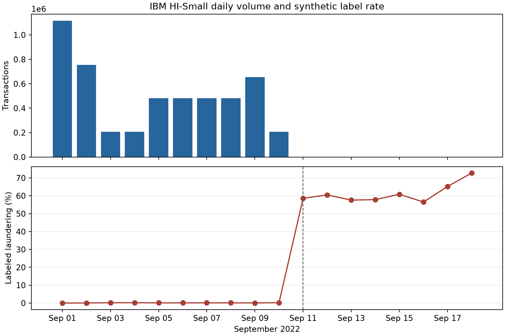
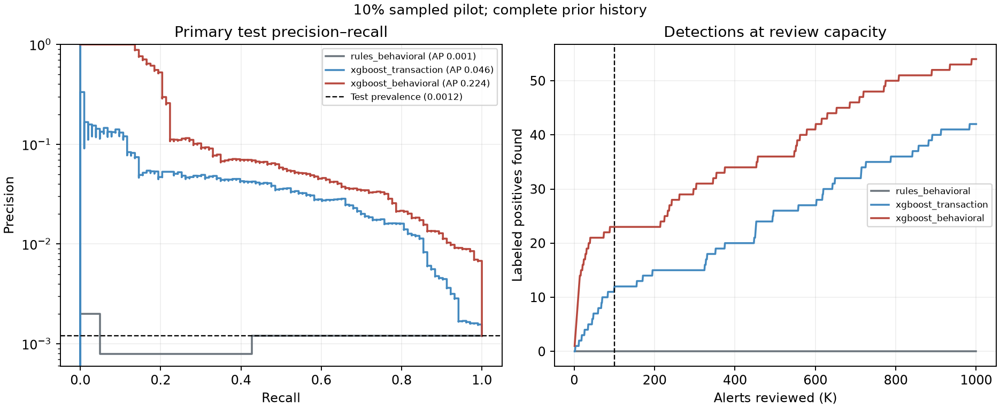

# IBM HI-Small: sampled AML monitoring pilot

**Run date:** 2026-10-08. **Status:** reproducible sampled pilot for the ML class, not a full-data benchmark or deployment validation. The input is IBM's synthetic `HI-Small_Trans.csv`; its [full-data profile](data_profile.md) covers all 5,078,345 rows. The modeling run read the entire CSV in chunks and selected 10% of transactions before September 11 with random seed 42. It kept all 1,108 later rows for a separate stress check. **Behavioral features were computed from every original transaction before selecting sampled modeling rows**, using disk-backed DuckDB windows. The raw data and detailed generated outputs are ignored by Git.

## Research question and design

Can transaction fields and earlier account activity rank synthetic laundering labels for a fixed investigator review capacity? Seven specifications were evaluated: currency-aware rules plus logistic regression, XGBoost, and a main-effects Explainable Boosting Machine (EBM), each ML model with transaction-only and behavioral feature sets.

The calendar boundaries were fixed before model fitting. Training uses September 1–6; validation uses September 7–8; the primary untouched test is September 9–10. September 11–18 is reported only as a stress period because both volume and label prevalence change abruptly. [Figure 1](figures/ibm_daily_profile.png) shows the shift.



| Period | Rows used | Positive labels | Label rate |
| --- | ---: | ---: | ---: |
| Training | 324,521 | 260 | 0.0801% |
| Validation | 96,746 | 112 | 0.1158% |
| Primary test | 86,066 | 103 | 0.1197% |
| Late stress | 1,108 | 655 | 59.12% |

Behavioral features use strictly earlier timestamps. Count features include a sender's transactions across currencies; rolling amount sums and averages use only the current payment currency. Transactions at the same timestamp cannot see one another. DuckDB computes these histories over **all 5,078,345 rows**; only model training and evaluation are sampled. A small fixture checks that DuckDB and Python produce the same feature values, and the full run checks that returned rows align with the sampled source records.

The implementation uses DuckDB [range window frames with `EXCLUDE GROUP`](https://duckdb.org/docs/current/sql/functions/window_functions) to omit same-time peers and [CSV ordinality](https://duckdb.org/docs/current/sql/query_syntax/from) to preserve original row IDs.

The rule baseline uses training-only 99th-percentile amount cutoffs within each payment currency, a prior 24-hour count threshold of three, and a five-times-prior-average threshold. No rule threshold was fit to validation or test labels. All models were fit on training rows, and the final specification was chosen using **validation average precision**. The JSON still names this metric `pr_auc`; it is scikit-learn's `average_precision_score`.

## Results

| Specification | Validation AP | Primary test AP | Test labels found in top 100 |
| --- | ---: | ---: | ---: |
| Currency-aware rules | 0.0010 | 0.0011 | 0 |
| Logistic, transaction only | 0.0120 | 0.0135 | 1 |
| XGBoost, transaction only | 0.0336 | 0.0459 | 12 |
| EBM, transaction only | 0.0185 | 0.0250 | 1 |
| Logistic, behavioral | 0.0133 | 0.0111 | 0 |
| **XGBoost, behavioral** | **0.3362** | **0.2245** | **23** |
| EBM, behavioral | 0.1519 | 0.1105 | 18 |

The selected XGBoost specification found 23 of 103 labeled positives among 100 reviewed transactions (23% precision and 22.3% recall at that capacity). Its primary-test prevalence was 0.1197%. A 300-repeat stratified row bootstrap gave a **descriptive** 95% AP interval of **0.1468–0.3128**. This interval does not model dependence between transactions from the same accounts or time variation. The full confusion count at this alert capacity is 23 labeled positives, 77 labeled negatives, and 80 labeled positives below the cutoff.



The late stress period had 59.1% labeled positives, so its AP values cannot be compared directly with the primary test. The selected model's stress AP was 0.9010; this is a shift diagnostic, not evidence of improved model quality. Weighted model outputs are not calibrated real-world laundering probabilities.

## Saved-score alert replay

A separate chronological replay sets a score cutoff from **validation scores only** to target 100 alerts per validation day. On the two primary test days, it emitted **221 alerts**, containing **24 positive labels**. On the late stress period, it emitted **388 alerts**, containing **361 positive labels**; this large change is another sign that the later data behaves differently. The replay uses precomputed scores and is not live model scoring. Daily counts are generated in `replay_daily_monitoring.csv`.

## Explanations and error analysis

The saved explanation artifact contains logistic coefficients, EBM term importance, XGBoost feature importance, and native XGBoost Tree SHAP contributions for five top-scored primary-test rows. [XGBoost's `pred_contribs` documentation](https://xgboost.readthedocs.io/en/stable/prediction.html) describes these as contributions to the raw model margin; here, that is log odds. For behavioral XGBoost, payment format had the largest measured feature importance; 24-hour and 7-day sender counts also appeared among the leading inputs. Importance and SHAP contributions describe model behavior in this sampled run, not causal drivers of laundering.

The diagnostic outputs include the top 100 alerts, the highest-scored missed positive labels, their original synthetic transaction fields, and performance grouped by payment currency. The two largest test currency groups, US Dollar and Euro, each had 32 positive labels; most other currencies had only one to seven. Small group metrics are leads for inspection, not stable subgroup comparisons. The [local dashboard](../app/dashboard.py) can review these outputs and save notes under ignored `results/`.

## Reproduce locally

After the [README setup and dataset download](../README.md), run from the repository root:

```bash
.venv/bin/python -m pip install -e '.[full-history,visualize]'
.venv/bin/python -m aml_monitoring.study --csv data/raw/HI-Small_Trans.csv --fraction 0.10 --seed 42 --full-history --output results/study_full_history_10pct
.venv/bin/python -m aml_monitoring.diagnostics --study-dir results/study_full_history_10pct --repeats 300
.venv/bin/python -m aml_monitoring.replay --study-dir results/study_full_history_10pct --daily-capacity 100
.venv/bin/python -m aml_monitoring.plots --profile results/ibm/data_profile.json --study-dir results/study_full_history_10pct --output-dir docs/figures
```

The study writes `study_manifest.json`, `metrics.json`, `predictions.csv`, `explanations.json`, and `report.md`. Diagnostics adds `diagnostics.json`, `diagnostics.md`, alert and missed-positive CSVs, and `case_context.csv`. Replay adds daily monitoring, emitted alert rows, and a summary. Reproducing the exact sample requires the same CSV version and row order; compare its SHA-256 with [the profiled file](data_profile.md). No generated predictions or account-level records are committed. The [model card](MODEL_CARD.md) records intended use and validation limits.

## What remains before a full research claim

Evaluate the full primary period rather than a 10% sample. Repeat the comparison across several seeds or time windows and add account-aware uncertainty estimates. Inspect the late-period generation shift before interpreting any stress result. Add probability calibration on validation data, more rule designs, and case-level explanation review. These steps are tracked in the [scope map](PROJECT_SCOPE.md).
